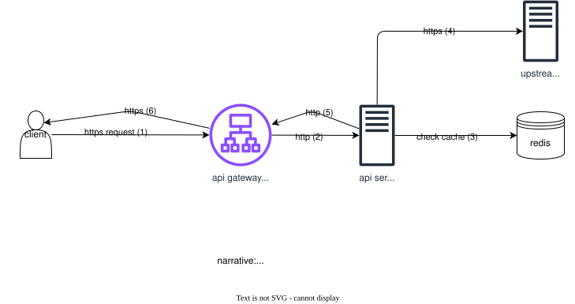

# liteproxy

A lightweight CORS proxy built in GoLang

This project is used purely as a way to learn some golang and provide a lightweight corsproxy hosted at [liteproxy.collinkleest.com](https://liteproxy.collinkleest.com)

This project is written in go, to install golang visit this [webpage](https://go.dev/doc/install)


## Table of Contents

1. [Usage](#usage)
2. [Quickstart](#quickstart)
3. [Docs](#docs)
4. [Pull Docker Image](#pull-docker-image)
5. [Docker Build / Publish](#docker-build-and-publish)
6. [Docker Compose](#docker-compose)

### Usage
Currently the proxy only supports `GET` requests.
The production endpoint for the api is `https://api.liteproxy.collinkleest.com`

Use /proxy with the query parameter `url` with your target url to hit the upstream endpoint.
`/proxy?url=<upstream url>`

**Note:** the proxy caches results for 15 minutes to enhance the speed and reliability.

### Quickstart

Download go dependencies

```bash
go mod download
```

Run the app

```bash
go run src/main.go
```

Build the app

```bash
go build src/main.go
```

Run the application with live reloading via [air](https://github.com/air-verse/air)
```bash
air -c .air.toml
```

### Docs
View the architecture diagram below. 




### Pull Docker Image

You can pull the [docker image](https://hub.docker.com/r/ckleest/liteproxy) from docker hub.

```bash
docker pull ckleest/liteproxy
```

### Docker Build and Publish

To build the image

```bash
docker build .
```

Build with tag

```bash
docker build -t collin/liteproxy .
```

To publish you'll need to login to docker hub

```bash
docker login
```

Publish to docker hub

```bash
docker push collin/liteproxy
```

### Docker Compose

Run the compose script

```bash
docker compose up -d
```

Tear down docker compose

```bash
docker compose down
```
